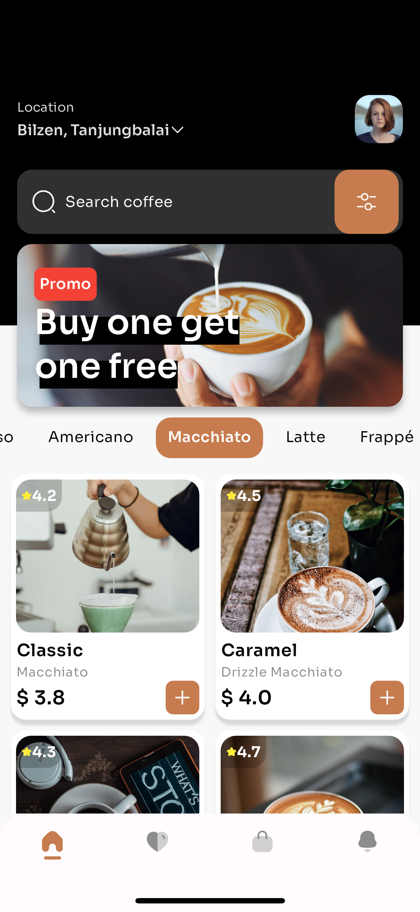
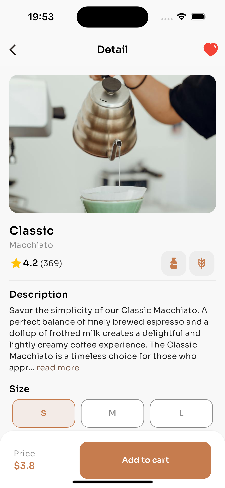
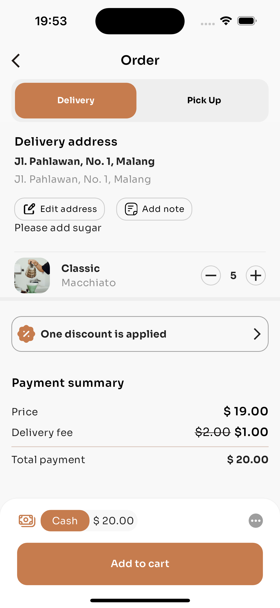
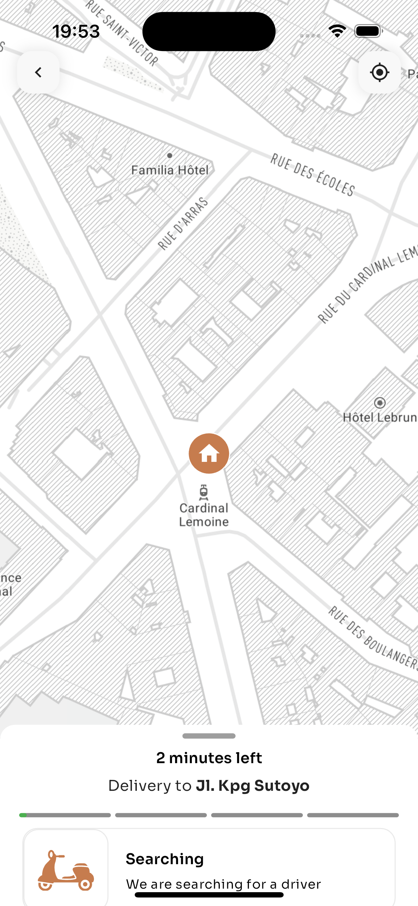

# This My PC

<div align="center">
        
</div>

<br />

<div align="center">

[]()
<br />

</div>

> This project is my submission for the HeyFlutter Coffee Shop Coding Challenge, a challenge proposed by the HeyFlutter youtube channel. The objective of this challenge is to develop a Coffee Shop App that showcases different varieties available at the shop. The challenge offers exciting rewards, including a shoutout on livestream, sharing of GitHub profile, and valuable feedback for the project.


## App Screenshots
&nbsp;&nbsp;&nbsp;&nbsp;

## Installation Steps

### Clone the repository

- Open your terminal or command prompt
- Navigate to the directory where you want to save the project
- Use the git clone command followed by the repository URL

```sh
git clone https://github.com/Ammar434/coffee_shop_ui_challenge.git
```
### Install dependencies

- Navigate to the project's directory

```sh
cd coffee_shop_ui_challenge
```
  
- Run the following command to install the required packages

```sh
flutter pub get
```
### Generate Required files

- Navigate to the project's directory

```sh
cd coffee_shop_ui_challenge
```

- Run the following command to generate the required files

```sh
flutter pub run build_runner build --delete-conflicting-outputs 
```

### Connect a device or emulator

* Physical Device

  1. Enable USB debugging on your device
  2. Connect it to your computer using a USB cable.

* Emulator

  1. Start an Android or iOS emulator using your preferred IDE or tools.
 
### Run the Project

- Use the following command to build and run the project

```sh
flutter run
```
## Minimum Versions

- Android: 21
- iOS: 12

## Dependencies 📦️
- [flutter_screenutil](https://pub.dev/packages/flutter_screenutil) - Adapting screen and font size.
- [flutter_svg](https://pub.dev/packages/flutter_svg) - SVG rendering and widget library for Flutter.
- [provider](https://pub.dev/packages/provider) - A wrapper around InheritedWidget to make them easier to use and more reusable.
- [flutter_map](https://pub.dev/packages/flutter_map) - A Flutter map plugin.
- [latlong2](https://pub.dev/packages/latlong2) - A simple library to handle operations with Latitude and Longitude.
- [xml](https://pub.dev/packages/xml) - A lightweight library for parsing, traversing, querying, and building XML documents.
- [flutter_typeahead](https://pub.dev/packages/flutter_typeahead) - A TypeAhead (autocomplete) widget for Flutter.

## Don't forget to ⭐ the repository.
